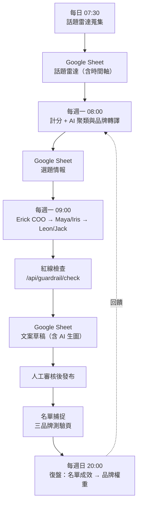

# Erick 品牌內容系統

四品牌（NAS / ABL / I8 / Erick）的內容自動化系統。從「發現值得寫的題目」到「產出符合品牌紅線的文案與名單入口」，一條線走完。

這個 repo 同時裝著兩套系統：**Next.js 儀表板**（本文件主要說明的部分）與 **Python Brand Intelligence OS**（根目錄的 `run_source_os.py` 與 `src/orchestrator/`）。

---

## 一、整體流程



關鍵在最後那條虛線：復盤算出的品牌權重會回到下週的選題計分，成效好的品牌下週更容易被選上。這是閉環，不只是把數字報出來給人看。

---

## 二、技術架構

**前端與 API**：Next.js 16 / React 19 / Tailwind v4 / TypeScript，部署於 Render。

**資料層**：`src/lib/storage.ts` 走 LocalStorage（看板與對話），Supabase 存已發布文章（`insights_articles`）與 AI 生圖（Storage bucket `article-images`）。

> 早期版本使用 Firebase Firestore，但六個 `NEXT_PUBLIC_FIREBASE_*` 從未設定，該分支永遠不會執行，卻讓整包 SDK 進了 client bundle。2026-08 已完整移除，詳見 `docs/SYSTEM_AUDIT_2026-08.md`。

**自動化**：n8n（`erick303.app.n8n.cloud`），所有金鑰以 credential 儲存並限制網域。

**AI**：Anthropic Claude（Erick COO 與各專家、話題聚類）、OpenAI `gpt-image-1`（配圖）。

---

## 三、儀表板功能

三欄式介面。左欄切換品牌與階段專案，中欄是與 Erick 營運長的對話室，右欄是五個專家看板（Maya 社群文案 / Leon 網頁架構 / Iris SEO / Jack 廣告數據 / Erick 品牌大腦），另有 Theo 負責發布前的觸及預測。

生成是**三段式**的，不是一次呼叫就有成品：

1. `stage: "coo"` — Erick 拆解任務，回傳四位專家的子提示詞
2. `stage: "expert", expertType: "maya_iris"` — 社群文案與 SEO 關鍵字
3. `stage: "expert", expertType: "leon_jack"` — Landing Page 與廣告數據（吃第 2 步的產出當 `prevData`）

---

## 四、品牌紅線（重要）

`src/lib/brand-guardrail.ts` 定義各品牌的禁用詞，**發布前一律檢查**。

ABL 禁「療效、根治、包治、治癒」，這類醫療效能宣稱在台灣可能觸法。I8 禁「靈性、頻率、能量場、顯化、療癒」，NAS 禁「信息場、調頻、能量磁場」。

違規時 `/api/publish` 與 `/api/publish-website` 回 422 並附上建議改寫，前端跳出確認對話框；要照原文發布須明確帶 `force: true`。`/api/guardrail/check` 是純檢查端點，供 n8n 在生成後、寫入草稿前使用。

規則移植自 Python 側的 `src/orchestrator/guardrail.py`，兩邊修改請同步。

---

## 五、轉換路徑

依信任漏斗設計，設定集中在 `src/data/brands/conversion.ts`：

| 品牌 | 漏斗階段 | 轉換目標 | 落地頁 |
|---|---|---|---|
| NAS | entry | 換 email | `/nas/quiz` |
| ABL | nurture | 換 email | `/abl/check` |
| I8 | nurture | 換 email | `/i8/diagnosis` |
| Erick | close | 預約諮詢 | `erickfirm.com/#contact` |

三個子品牌的目標都是換 email，**成交發生在 Erick 這一層**。把 NAS 的陌生受眾直接導向諮詢預約是跳級，會流失掉本來可以先養成名單的人。

名單經 `/api/lead` 轉送 n8n，寫入 Google Sheet「測驗名單」並自動寄出結果信。

---

## 六、話題雷達

`src/data/radar/keywords.ts` 是「關鍵字宇宙」，分四層：`core`（核心專業詞）、`problem`（客戶問題詞）、`context`（情境詞）、`bridge`（趨勢連接詞）。n8n 經 `/api/radar/keywords` 取用，所以關鍵字進版控而不是散在 n8n Code 節點裡。

**雷達是關鍵字驅動，不是熱榜驅動。** 實測台灣 Google Trends 即時熱搜是「7795、南亞科、00881配息、許常德」，品牌相關度趨近於零。熱榜只歸入 `bridge` 層作為借勢素材，不作為話題來源。詳見 `docs/PIPELINE_FINDINGS_AND_PLAN.md`。

`problem` 層命中率最高，這份清單的品質直接決定雷達的品質。

---

## 七、快速開始

```bash
cd "/Volumes/4T/Frontend Dashboard"
npm install
npm run dev
```

環境變數複製 `.env.local.example` 後填入。`AI_PROVIDER` 可設 `mock`（免金鑰、本地模擬）、`openai`、`gemini`、`anthropic`、`n8n`。

測試：

```bash
npx tsc --noEmit                       # 型別檢查，應為零錯誤
npx tsx tests-ts/guardrail.test.ts     # 品牌紅線
npx tsx tests-ts/quiz.test.ts          # 測驗計分（窮舉 1024 種作答）
npx tsx tests-ts/conversion.test.ts    # 轉換設定完整性
```

`next.config.ts` 的 TypeScript 檢查已恢復啟用。若 build 因型別錯誤失敗，請修型別，不要把 `ignoreBuildErrors` 加回來——那只會讓錯誤延後到線上以 500 的形式出現。

---

## 八、相關文件

- `docs/SYSTEM_AUDIT_2026-08.md` — 系統健檢與清理紀錄
- `docs/SIX_ROLE_GAP_ANALYSIS.md` — 六角色工作流與現有系統的落差分析
- `docs/PIPELINE_FINDINGS_AND_PLAN.md` — 名單、生圖、轉換路徑的實測結果
- `docs/BRAND_GUIDELINES.md` — 四品牌定位、語氣與禁用詞
