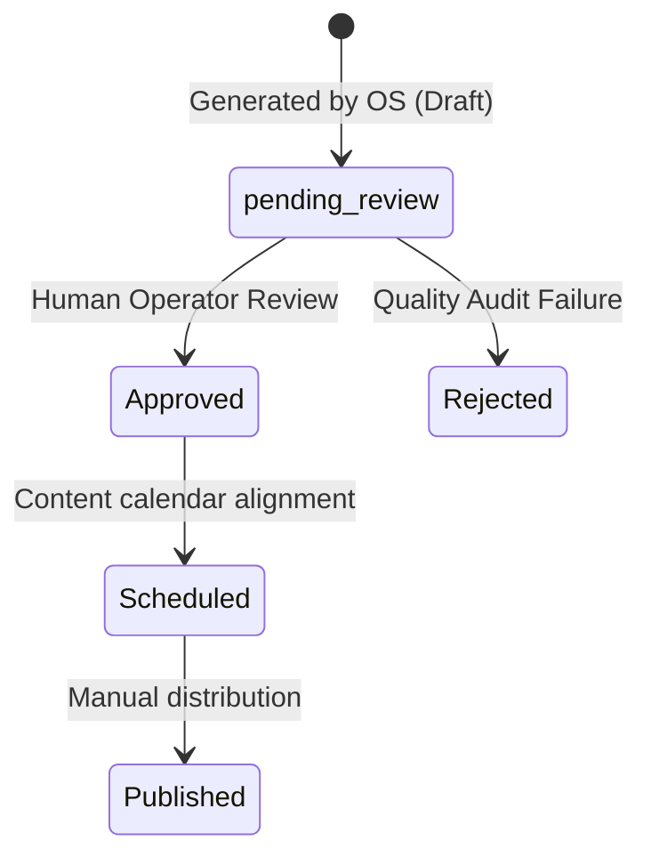

# Approval Flow Audit

This document validates that the Brand Intelligence OS implements a strict draft-only policy and prevents automated publishing.

---

## 1. Core Workflow Restrictions

To protect brand integrity, all assets generated by the Content Factory must abide by the following constraints:
1. **No Auto-Publishing**: Under no circumstances does the system publish content directly to social media accounts, websites, or newsletters.
2. **Draft Database State**: Every new content asset is written to the SQLite `Asset` table with the property `"status": "pending_review"`.
3. **Traceability Reference**: Generated assets store references to the raw `Content` IDs used during analysis, allowing the human reviewer to verify inputs.

---

## 2. Status Lifecycle Model

The asset transition flowchart is structured as follows:

---

## 3. Compliance Validation Checklist

* [x] **Database Audit**: All draft records successfully write `"status": "pending_review"` under lifecycle state `"Draft"`.
* [x] **API Check**: All publish integrations are disabled.
* [x] **Traceability Link**: Source links are retained in the asset properties.
