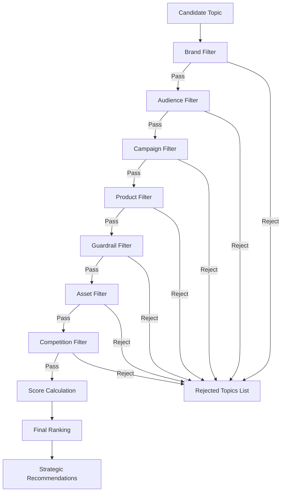

# Decision System V3

The Brand Intelligence OS Decision System has been upgraded from a simple weighted scoring mechanism to a robust, multi-stage filtering and ranking pipeline. This ensures that topics are strategically vetted before resources are allocated for scoring.

---

## 1. Decision Flow Overview

The V3 Decision Flow follows a sequential process:

---

## 2. Pipeline Components

### Phase 1: Filters (All-or-Nothing Gatekeepers)
Every candidate topic must pass through all 7 filters. If a topic fails any filter:
1. It is immediately eliminated from ranking.
2. It is added to the `Rejected Topics` list with a descriptive reason.

The 7 sequential filters are:
1. **Brand Filter**: Checks brand alignment (e.g., whether ABL keywords exist for ABL, or NAS for NAS).
2. **Audience Filter**: Evaluates segment match (e.g., matching "35~55 女性", "創業者", "CEO").
3. **Campaign Filter**: Assesses active campaign thematic alignment.
4. **Product Filter**: Ensures topic supports the currently promoted product (e.g., "人生承接力").
5. **Guardrail Filter**: Verifies that the language does not violate brand compliance guidelines (metaphysical bans). It automatically rewrites the topic to brand-compliant wording if a minor violation is detected.
6. **Asset Filter**: Cross-checks the **Asset Registry** to determine if the topic has been oversaturated. It also dynamically adapts the recommended content format based on previous publishes.
7. **Competition Filter**: Automatically filters out high-competition topics unless brand differentiation is sufficiently high.

### Phase 2: Scoring (Only for Survivors)
Only candidate topics that pass all 7 filters are scored using the updated V2/V3 formula:

$$\text{Final Score} = \text{Trend Score} + \text{Opportunity Score} + \text{Gap Score} + \text{ROI Score} + \text{Brand Strategy Weight} + \text{Audience Match} + \text{Current Product Match}$$

### Phase 3: Final Ranking & Recommendation
Topics are sorted by their `Final Score` descending. The highest-scoring topic is promoted to the daily top recommendation with calculated format adaptation, appropriate CTA, and structured confidence metrics.
