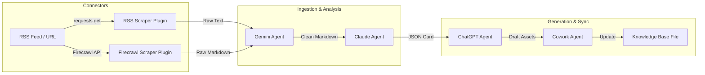

# Sprint 1 Integration Report

We have completed the **Sprint 1 Integration Phase** of the Brand Intelligence OS. The system's simulation layers have been replaced with production-ready connectors and API integrations while keeping the core architecture and registries frozen.

---

## 1. Scope Accomplished

* **Connectors Integrated**:
  * **RSS**: Direct HTTP fetching and XML parsing for RSS and Atom feeds.
  * **Firecrawl**: Webpage-to-Markdown scraping via Firecrawl REST API.
* **LLM Providers Integrated**:
  * **Gemini API** (`gemini-1.5-flash`): Content collection and summarization.
  * **OpenAI API** (`gpt-4o-mini`): Copywriting, translation, and draft generation.
  * **Claude API**: Remains optional, behind the Router interface (with graceful mock fallbacks).
* **System Pipeline**: Flow connects Source ➔ Ingest (Gemini) ➔ Clean (Claude) ➔ Content Factory (ChatGPT) ➔ Sync (Cowork).
* **Daily Report**: Fulfills success criteria by generating a unified Daily Intelligence Report.

---

## 2. Dynamic Integration Workflow

The end-to-end integration pipeline works as follows:

---

## 3. Graceful Key Fallbacks
All integrations support a **dual execution mode**:
1. **Real Mode**: Triggered automatically when corresponding API keys (`OPENAI_API_KEY`, `GEMINI_API_KEY`, `FIRECRAWL_API_KEY`, `ANTHROPIC_API_KEY`) are present in `.env` or system environment.
2. **Mock Fallback Mode**: If any key is missing or external services are offline, the agent/connector logs a warning and falls back to clean, context-aware simulated data. This keeps the CLI and test suite fully runnable and robust.
