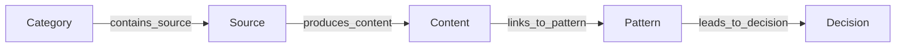

# Knowledge Graph Design: Source-Centric Schema

The Knowledge Graph connects all domain objects via semantic edges in a highly relational, queryable layout.

## 1. Relational Sequence

The database has been refactored to prioritize **Source** over **Brand**. The primary sequence of knowledge node traversals is:



---

## 2. Standard Registry Node Requirements

All elements registered inside the Knowledge Graph conform to the standard Object schema:

* **`id`**: Unique text primary key.
* **`type`**: Node semantic classification (`Category`, `Source`, `Content`, `Pain Point`, `Desire`, `Offer`, `CTA`, `Pattern`, `Content Asset`, `Analytics`, `Learning`, `Decision`).
* **`properties`**: Key-value JSON representing parameters.
* **`lifecycle`**: State machine designation (e.g. `Candidate`, `Active`, `Draft`, `Knowledge`).
* **`owner`**: Tenant classification (e.g. `test-brand`, `system`).
* **`created_at`** / **`updated_at`**: Timestamps.

---

## 3. Query Path Traversal

The graph interface supports tracing a Category's child nodes downstream. Tracing a Category returns paths connecting the category registry entry down to the finalized daily decision recommendations:

```sql
SELECT cat.id, src.id, cnt.id, pat.id, dec.id
FROM objects cat
JOIN object_relations r1 ON cat.id = r1.source_id AND r1.relation_type = 'contains_source'
JOIN objects src ON r1.target_id = src.id
JOIN object_relations r2 ON src.id = r2.source_id AND r2.relation_type = 'produces_content'
JOIN objects cnt ON r2.target_id = cnt.id
...
```
This is verified by Scenario 6 in our testing suite.
